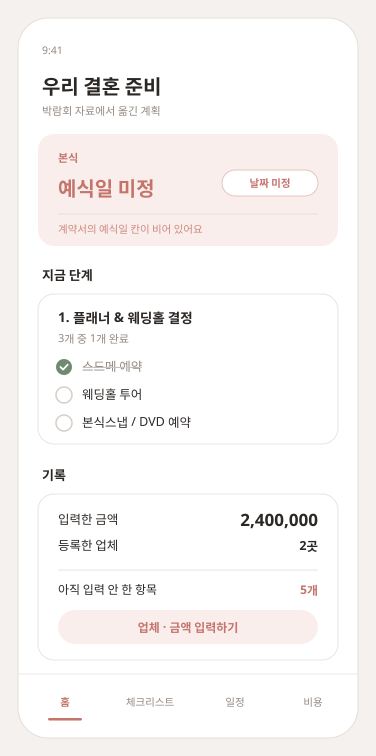

# design

화면 시안 8개. 박람회 자료의 **항목 구조**를 근거로 만들었다.

> ⚠️ **화면에 보이는 업체명과 금액은 전부 예시값이다.**
> 실제 계약 금액 · 날짜 · 준비 결정은 개인 기록이라 이 저장소에 두지 않는다.
> 앱의 데이터는 브라우저에만 저장되고 저장소로 올라가지 않는다.

| 파일 | 내용 |
|------|------|
| `00-overview.png` | 8개 화면 전체 (6216×1880) |
| `01-home.png` | 홈 (1128×2268) |
| `02-checklist.png` | 체크리스트 |
| `03-schedule.png` | 일정 (목록) |
| `04-cost.png` | 비용 |
| `05-vendor-amount-input.png` | 업체 · 금액 입력 |
| `06-calendar.png` | 일정 (월 캘린더) |
| `07-venue-compare.png` | 웨딩홀 비교 |
| `08-venue-input.png` | 웨딩홀 기록 (투어 현장 입력) |
| `screens.svg` | 원본 (8개 화면 한 장) |
| `0N-*.svg` | 화면별 원본 |

## 원칙 — 업체와 금액은 앱이 제안하지 않는다

지역 · 시기 · 상품에 따라 다르고, 자료 한 곳의 가격표를 기준값처럼 쓰면
틀린 숫자를 신뢰하게 만든다.

| | 앱이 하는 것 | 앱이 안 하는 것 |
|---|---|---|
| 업체 | 입력한 업체명을 저장, 전에 쓴 업체 다시 고르기 | 업체 추천 · 평점 · 순위 |
| 금액 | 입력한 것만 저장 · 합산 | 시세 · 평균가 · 추천가 제시 |
| 항목 | 준비할 항목을 목록으로 제시 | 어떤 상품이 좋은지 판단 |
| 자료 값 | 입력 화면에 **참고 문구**로만 표시 | 기본값으로 미리 채워 넣기 |

그래서 화면에는 이런 상태가 생긴다.

- 업체 자리는 **업체명 태그** 또는 점선 **`업체 입력`**
- 금액 자리는 입력된 숫자 또는 점선 **`금액 입력`**
- 합계는 **"입력한 금액 합계"** — 미입력 항목은 더하지 않고 개수만 알림

### 업체는 항목마다 따로, 재사용은 쉽게

한 업체가 여러 항목에 걸친다 (스튜디오 = 촬영 + 원본, 드레스샵 = 대여 + 헬퍼비 + 투어비).
그래서 업체는 **항목별 필드**로 두되, 입력 화면에서 **전에 쓴 업체를 바로 고를 수 있게** 한다.

## 웨딩홀 비교 — 앱이 고르지 않는다

"업체를 추천하지 않는다"와 "웨딩홀을 비교한다"는 어긋나 보이지만 다르다.

| 앱이 하는 것 | 앱이 안 하는 것 |
|---|---|
| 투어하며 **직접 적은 값**을 나란히 놓기 | 어느 홀이 나은지 판단 |
| 자료의 계산식으로 합계 내기 | 점수 · 별점 · 순위 매기기 |
| **본인이 내린 결정과 어긋나는 부분** 짚기 | 외부 평판 · 후기 가져오기 |

비교 항목은 체크리스트의 웨딩홀 구성에서 그대로 왔다 —
홀 사용료 · 꽃장식 · 식대 · 보증인원, 그리고 신부대기실 · 폐백실 · 혼구용품.

**예상 합계는 자료의 계산식을 쓴다**: `홀 사용료 + 꽃장식 + (보증인원 × 식대)`.
값이 하나라도 비면 **"계산 불가"** 로 두고 억지로 채우지 않는다.

**어긋남 짚기**: 폐백실이 없는 홀인데 체크리스트에서 폐백을 '진행'으로 두었다면
그 사실만 알려준다. *"그래서 저쪽을 고르세요"* 라고는 하지 않는다.

### 기록 화면은 투어 현장 기준으로

`08-venue-input`은 **서서 한 손으로 쓰는 화면**이다.

- 전부 **한 줄 = 한 항목** 리스트. 큰 입력 상자를 세로로 쌓지 않는다
- 포함 여부는 타이핑 대신 **있음 / 없음 / 모름** 3단 선택.
  `모름`이 따로 있는 게 중요하다 — 투어 중엔 못 물어보고 넘어가는 게 정상이고,
  비워두면 "안 물어본 것"인지 "없는 것"인지 구분이 안 된다
- **예상 합계가 입력 중에 바로 갱신된다.** 홀 사용료만 보고 판단하지 않도록
- 저장 버튼은 `비교표에 담기` — 기록의 목적지를 버튼이 말한다

## 캘린더 — 월만 아는 일정은 달력에 올리지 않는다

일정 탭은 **목록 / 월** 두 뷰를 오간다.
자료의 일정은 전부 **월 단위**라 달력 칸에 올릴 근거가 없다.

그런 일정은 그리드 아래 **"달력에 못 올린 일정"** 으로 모아 두고 `날짜 정하기`로 유도한다.
**없는 날짜를 임의로 배치하지 않는다.**

> 월만 아는 일정을 달력 어딘가에 억지로 찍으면 사용자는 그 날짜를 사실로 믿는다.
> "아직 날짜가 없다"는 것 자체가 정보다.

## 화면 구조의 근거

| 화면 요소 | 근거 |
|-----------|------|
| 체크리스트 카테고리 5종 | 자료의 `구분` 열 (웨딩홀 · 허니문 · 스드메 · 혼수 · 기타) |
| 스드메 항목 구성 | 자료의 `품목` · `내용` 열 |
| 패키지 포함 / 별도 구분 | 계약서의 '별도' 안내 |
| 6단계 · 소요시간 · 벌수 | 일정표 인쇄면 |
| 결제 3단 (10 / 70 / 20%) | 계약서 인쇄면 |
| 위약금 경계 = 촬영일 D-90 | 계약서 인쇄면 |
| 웨딩홀 비교 항목 · 합계식 | 체크리스트의 웨딩홀 구성 |

## PNG 다시 만들기

### 1) 화면별 SVG로 분리

```bash
python3 - <<'PY'
import re
src = open('design/screens.svg', encoding='utf-8').read()
style = re.search(r'<style>.*?</style>', src, re.S).group(0)
groups = re.findall(r'<g transform="translate\((\d+),140\)">(.*?)\n</g>', src, re.S)
names = ['01-home','02-checklist','03-schedule','04-cost','05-vendor-amount-input',
         '06-calendar','07-venue-compare','08-venue-input']
PAD=18; W,H = 340+PAD*2, 720+PAD*2
for (x,body),name in zip(groups,names):
    open(f'design/{name}.svg','w',encoding='utf-8').write(
f'''<svg xmlns="http://www.w3.org/2000/svg" viewBox="0 0 {W} {H}" width="{W}" height="{H}">
{style}
<rect width="{W}" height="{H}" fill="#F4F1EE"/>
<g transform="translate({PAD},{PAD})">{body}
</g>
</svg>
''')
PY
```

### 2) chromium으로 렌더 후 크롭

**함정 두 가지**

1. SVG를 chromium으로 **직접 열면 body 기본 여백 8px**이 붙는다 → HTML로 감쌀 것
2. 헤드리스 chromium은 요청한 창 높이보다 **뷰포트가 약 87px 작다** →
   여유 있게 렌더한 뒤 잘라내야 하단 탭바가 안 잘린다

```bash
CH=/opt/pw-browsers/chromium-1194/chrome-linux/chrome
cat > wrap.html <<'EOF'
<html><head><meta charset="utf-8"><style>html,body{margin:0;padding:0;background:#F4F1EE}img{display:block}</style></head>
<body></body></html>
EOF
$CH --headless --no-sandbox --disable-gpu --hide-scrollbars \
    --force-device-scale-factor=3 --screenshot=01-home.png \
    --window-size=376,896 wrap.html          # 756 + 140 여유
python3 -c "from PIL import Image; Image.open('01-home.png').crop((0,0,1128,2268)).save('01-home.png')"
```

### 3) 검증

```bash
python3 -c "
from PIL import Image
im=Image.open('01-home.png').convert('RGB'); w,h=im.size
ys=[y for y in range(h) if all(c>248 for c in im.getpixel((w//2,y)))]
print('흰영역 CSS', ys[0]/3, '~', ys[-1]/3, '(기대 19~737)')"
```
